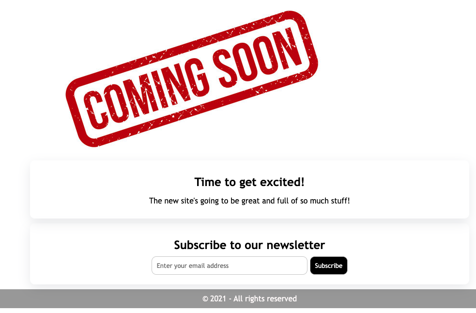

# week-1-mini-project
## a simple Landing page example

This is uses some simpel HTML elements such as a Google Font, form elements, flexbox, borders, semantic html elements, type, class and universal CSS selector and Box Shadow

